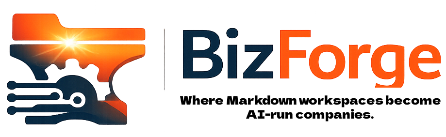
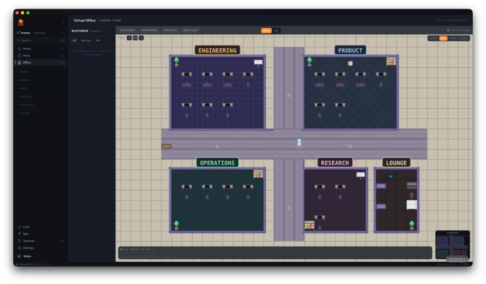

# Bizforge Command Center

<p align="center">
  
</p>

<p align="center">
  
</p>

Native desktop app. You run a command center for AI agent teams: hire agents, watch them grind in a virtual office, track spend, run the whole show from one window.

Stack is SvelteKit 2 plus Tauri 2. Plugs into [OSA](https://github.com/Miosa-osa/OSA), Claude Code, Codex, JidoClaw, and the rest of the adapter lineup. Flip on mock data and you’re offline—no backend, no excuses.

## One command and you’re in

```bash
# One-liner launch
./scripts/launch.sh
```

That fires the native desktop shell with the Vite dev server. Done.

## Build it yourself

### What you need on disk

- Node.js 20+
- Rust toolchain (`rustup`, `cargo`, `rustc`)
- macOS: Xcode Command Line Tools (`xcode-select --install`)
- Linux: `libwebkit2gtk-4.1-dev`, `libgtk-3-dev`, `libssl-dev`

### Install, run, ship

```bash
# Install dependencies
npm install

# Option 1: Browser dev mode (fastest)
npm run dev
# Open http://127.0.0.1:5200/app

# Option 2: Native desktop app (dev mode)
npm run tauri:dev

# Option 3: Production build
npm run tauri:build
# macOS: src-tauri/target/release/bundle/macos/Bizforge.app
# Linux: src-tauri/target/release/bundle/appimage/
```

## Adapters

Bizforge talks to AI backends through **adapters**. Installed tools get detected automatically; wizards walk you through the rest.

| Adapter | Type | Install |
|---------|------|---------|
| **OSA** | Elixir/OTP agent framework | `curl -fsSL https://raw.githubusercontent.com/Miosa-osa/OSA/main/install.sh \| bash` |
| **Claude Code** | Anthropic CLI agent | `npm install -g @anthropic-ai/claude-code` |
| **Codex** | OpenAI CLI agent | `npm install -g @openai/codex` |
| **JidoClaw** | Jido-based agent platform | `curl -fsSL https://raw.githubusercontent.com/robertohluna/jido_claw/main/install.sh \| bash` |
| **OpenClaw** | Open-source agent | `npm install -g openclaw` |
| **Hermes** | Rust agent runtime | `cargo install hermes-agent` |
| **Bash** | Shell execution | Built-in |
| **HTTP** | Generic REST adapter | Built-in |

### Wire up OSA

OSA is the main adapter. Built-in assistant lives under Settings > Integrations:

1. **Auto-detect** — scans `~/.osa/`, common paths, and live ports (9089/9090)
2. **One-click install** — runs the official script if OSA’s missing
3. **Health check** — proves the connection, surfaces version and port
4. **Start/stop** — boots or kills the OSA daemon from the app

### Optional backend

Mock mode covers you solo. Want the real Bizforge Phoenix API? Spin this up:

```bash
cd ../backend
mix phx.server  # Runs on port 9089
```

## First launch: don’t skip this

The onboarding flow hits:

1. **Welcome** — start clean or import an existing `.bizforge/` workspace
2. **Provider** — lock in your LLM (Anthropic, OpenAI, Ollama, whatever) and drop the API key
3. **Adapter** — pick the agent backend
4. **Workspace** — name it, point at the directory
5. **Team** — draft hires from the 330+ agent library
6. **Launch** — writes config to Tauri secure store, dumps you on the dashboard

Provider secrets sit in the OS keychain through Tauri’s secure store. Not in `localStorage`. Ever.

## Where everything lives

```
src/
├── routes/
│   ├── app/                 # 36 pages (dashboard, agents, office, library, etc.)
│   └── onboarding/          # First-run setup wizard
├── lib/
│   ├── api/                 # HTTP client + SSE streaming
│   │   ├── client.ts        # API client (auto-falls back to mock)
│   │   ├── mock/            # Full mock data for offline use
│   │   ├── sse.ts           # Server-Sent Events with auto-reconnect
│   │   └── types.ts         # TypeScript interfaces
│   ├── components/          # 120+ components
│   │   ├── chat/            # Chat UI, streaming, tool calls
│   │   ├── office/          # Virtual office (2D pixel + 3D)
│   │   ├── library/         # Agent/skill/template cards
│   │   ├── costs/           # Budget dashboard, anomaly alerts
│   │   └── layout/          # Sidebar, command palette, toasts
│   ├── services/            # System integration layer
│   │   ├── adapters.ts      # Adapter detection & installation
│   │   ├── credentials.ts   # Secure credential storage
│   │   └── osa.ts           # OSA health, setup, onboarding
│   └── stores/              # Svelte 5 rune stores (30+)
src-tauri/                   # Rust native shell
├── src/
│   ├── lib.rs               # Plugin registration
│   └── filesystem.rs        # Workspace scanning, adapter detection, OSA setup
├── tauri.conf.json          # Window config, CSP, permissions
└── Cargo.toml               # Rust dependencies
```

## NPM scripts you actually use

| Command | Description |
|---------|-------------|
| `npm run dev` | Vite on :5200 — fastest feedback loop |
| `npm run build` | Drops static assets in `build/` |
| `npm run check` | TS + Svelte — catch lies before runtime |
| `npm run tauri:dev` | Native shell, dev mode |
| `npm run tauri:build` | Ship `.app` / AppImage |
| `npm run test` | Test suite |
| `npm run lint` | Lint + format gate |

## How the pieces fit

- **Frontend**: SvelteKit 2, Svelte 5 (runes), Tailwind CSS v4
- **Desktop**: Tauri 2 (Rust + WebView), cross-platform (macOS, Linux, Windows)
- **Backend**: Phoenix 1.8 on port 9089 (optional — app works offline with mock data)
- **Adapters**: Pluggable AI backends via Tauri IPC (binary detection + TCP health checks)
- **Security**: Provider keys in OS keychain (Tauri secure store), no plaintext storage
- **Design**: Glassmorphic dark theme with [Foundation](https://github.com/Miosa-osa/foundation) design system tokens
- **Workspace**: `.bizforge/` directory protocol for portable agent/team/schedule definitions
